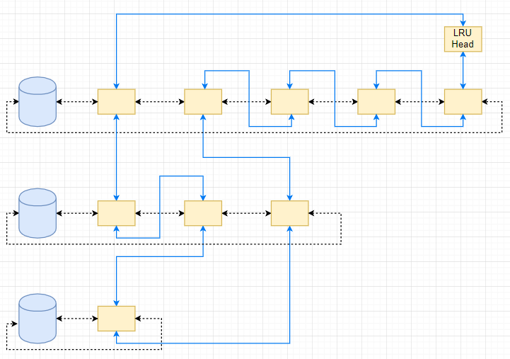
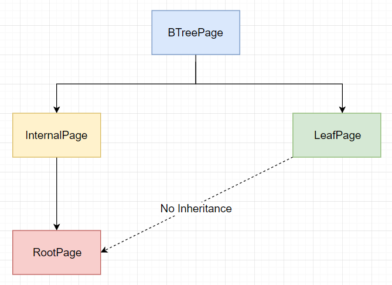
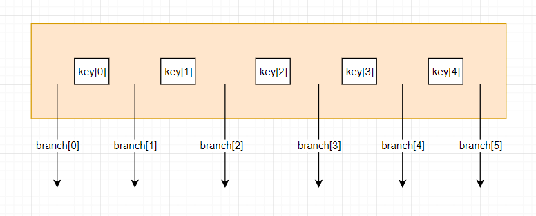
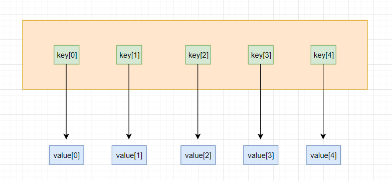

# xjbDB：一个 xjb 写的 DB

- [数据库的限制](#1)
- [Pager](#2)
- [Tree](#3)
- [VM](#4)
- [SQL Parser](#5)
- [Query Plan](#6)
- [Transaction](#7)


&nbsp;   
<a id="1"></a>
## 数据库的限制

- 支持的数据类型：int, char, varchar（字符串有效长度 <= **57**B）
- 一个 tuple 的长度 <= 66B
  - INT 4B
  - VARCHAR(n)  始终占 n B，如果少，用 `'\0'` 填充
  - 例如：INT, VARCHAR(15), INT, CHAR(20) 占 4+15+4+20 B
- 数据库中最多有30张表，每张表最多15个column
- 事务是串行化处理的


&nbsp;   
<a id="2"></a>
## Pager

文件名：file.xjbDB   
日志名：file.xjbDB.log

### DB Meta
- (4B) page_t
- (4B) page_id
- (4B) cur_page_no
- (4B) table_num
- (4B) next_free_page_id
- (8B * (table_num))
  - (4B) table_page_id
  - (4B) name_offset
  - ...
- table_name 字符串（从260B开始，每25B一个block）

限制：

- table_num <= 30
- table_name <= 24B

支持的基本操作：

- 根据 table 名找到 table_id，若不存在，返回 `NOT_A_PAGE`
- 创建 table：找到一个 `OBSOLETE` 的 record，然后写入
- 删除 table：将 `index` 所对应的 record 标记为 `OBSOLETE`，并且所有table整体前移。

### Table Meta Page
- (4B) page_t
- (4B) page_id
- (4B) BT_root_id
- (4B) col_num
- (4B) row_num
- (4B) default_value_page_id
- (14B * 15) table_meta_info
  - (4B) col_name_offset
  - (2B) col_type
  - (2B) str_len (used when col_type is CHAR/VARCHAR)
  - (2B) constraint_type
  - (4B) value (used when constraint_type is DEFAULT(value_offset) or FK(table_id))
- col_name 字符串（从234B开始，每一个51Bblock）

限制：

- 每个table最多15个column
- 每个 column 名字最多 50B

支持的操作：

- 插入一个 column，并可能设置 default_value

### Internal Page
- (4B) page_t
- (4B) page_id
- (4B) parent_page_id
- (4B) nEntry 有几个 key
- (2B) key_t `INT` 或 `(VAR)CHAR`
- (2B) str_len 如果 key_t 为 `(VAR)CHAR`，指定长度
- (4B * (2nEntry+1))
  - (4B) 孩子 page_id
  - (4B) key `INT` 或 `(VAR)CHAR`
  - ...
  - ...
  - (4B) 孩子 page_id
- key 字符串（从152B开始，每58B一个block）

支持的基本操作：

- 插入 key：找到一个 `OBSOLETE` 的 record，然后写入
- 删除 key：将 `index` 所对应的 record 标记为 `OBSOLETE`

### Value Page（不进入 buffer pool，生命周期由 Leaf 或 RootLeaf 控制）
- (4B) page_t
- (4B) page_id
- (4B) parent_page_id
- (4B) nEntry 有几项
- 15 个 record（从 16B 开始）

record 格式为：`mark(1B), content(<=66B)`   
把 1024B 分成 15个 67B，这样每个67B是一个block，管理起来很方便。   

支持的基本操作：

- 插入：遍历这15个block，找到一个 `OBSOLETE`（即0）
- 删除：标记这个block为 `OBSOLETE`

### Leaf Page
- (4B) page_t
- (4B) page_id
- (4B) parent_page_id
- (4B) nEntry 有几个 k-v
- (2B) key_t `INT` 或 `(VAR)CHAR`
- (2B) str_len 如果 key_t 为 `(VAR)CHAR`，指定长度
- (4B) value_page_id
- (4B) previous_page_id
- (4B) next_page_id
- (8B * nEntry) nEntry 个 k-v
  - (4B) key `INT` 或 `(VAR)CHAR`
  - (4B) value-index，指向 value_page_id 中该内容的 index（index*68 即可得到 Value Page 中的 offset）
- key 字符串（从152B开始，每58B一个block）

支持的基本操作：

- 插入 value：调用 `value_page->insert()`
- 删除 value：调用 `value_page->erase()`

### FREE Page List


维护一个链表，表头是 DBMeta 中的 `next_free_page_id`，指向下一个 free-page，之后的 free-page 有两个属性：`page_t_` 是 `FREE`，`page_id_` 不是自己，而是 `next_free_page_id_`，最后一个 free-page 指向 `NOT_A_PAGE`

#### 保证 free-page-list 中的 page 一定不在 buffer pool 中；并且 vm 中的 next_free_page_id 永远和 disk_manager 中保持一致

当在 B+Tree 中发生 merge 时，会调用 `Page::set_free()` 标记。随后的 `VM::flush()` -> `Hash_LRU::flush()` -> `virtual xxPage::update_data()` 会将标记为 `FREE` 的 page 中的 `page_id_` 写成 `next_free_page_id`，随后从 buffer pool 中去除，在盘上形成链表。

另一方面，请求分配 page 时，`DiskManager::AllocatePage()` 检查是否还有 free page，并且更新 disk 和 vm 到下一个 free page

### DiskManager


### Log 协议

- undo 是记录事务执行前所有在事务中被修改的页的二进制拷贝，新加入的页不拷贝
- redo 直接记录 sql 语句，重启时塞到 sql pool 里面当做从控制台读入的

log 的第0页作为 LogMetaData，之后顺序放每个脏页的拷贝。

MetaData 结构：

- sql 语句
- ...
- 末尾处，连续的24B
- *[depricated]* prev_last_page_id：本次事务执行前的最大页
- nuance：一个随机数
- undo_log_num：拷贝的脏页对应的原页数量
- undo_check：拷贝的所有页的每4B看作int累加，再加上 nuance
- redo_sql_len：sql 长度
- redo_check：同 undo_check

流程

- 先拷贝脏页对应的原页
- 计算一下这些值
- 先把 nuance 写成 0，让 check fail
- 写 undo_log_num, undo_check, sql 语句, redo_sql_len, redo_check
- 写 nuance
- 数据文件落盘
- 破坏 log：把 nuance 改成 0

恢复

- 只要 nuance 和 undo_check 计算不一致，则认为不需要恢复
- 否则
  - 如果 sql 为空并且检查一致，那么只需要 undo
  - 如果 sql 非空并且 check 计算一致，那么需要 undo 和 redo
      - 这里的 redo 是把 sql 发送回 sql pool
  - 如果 sql 非空并且检查不一致，那么 gg

回放：undo

- 把拷贝的页读出来，直接覆盖对应的数据文件的页
- 之后 `VM::start()` 拿到的第一个 sql 就是 redo sql

### BufferPoolManager

- 管理所有 Page，除了3个：**DBMetaPage 和 TableMetaPage**，它们总是被 VM 管理；**ValuePage** 总是被 LeafPage 或 RootPage 管理
- 一个 Page，如果不在 BufferPool 并且还在内存，那么一定在 DiskManager 中被标记为 dirty。（在 evict 时标记为 dirty；注：事实上我已经取消了 `lru_evict`）

#### Concurrent Hash + LRU

结合了 hash 与 lru，结点构成：`page_id`, `Page*` 和 4个指针：`prev_hash`, `next_hash`, `prev_lru`, `next_lru`   
每个 hash bucket 中都是一个双向链表；整个 LRU 也是一个双向链表。



如果不需要支持多线程，那么下面这个结构就可以：其中 lru 持有真正的数据内容，hash 加快索引。

```cpp
std::list<pair<Key, Value>> lru;
std::unordered_map<Key, list<pair<Key, Value>>::iterator> hash;
```

需要多线程时，让两者其中某一方持有数据都不合适，于是就让它俩是一个结点了。（参考 levelDB/util/cache.cc LRUCache）

- find
  - 在 hash bucket 里面找，这里把结点 ref 一下，防止 evict
  - 进了 lru，unref 结点，然后 update lru（即把结点放到开头）
- insert
  - 添加进 bucket
  - 再添加进 lru
- erase
  - 把结点 ref 一下，**防止 evict 和 erase 同时搞一个结点**，然后从 bucket 中移除
  - 进入 lru
      - 如果已经被 evict，那么只 unref 结点（不 `size--`，冲突时 evict 负责 `size--`）
      - 否则正常删除，unref 结点，并 `size--`
- evict（private）
  - `size--`
  - 把结点 ref 一下，然后从 lru 中删除
  - 进入 bucket
      - 如果已经不在了，只 unref 结点
      - 正常删除，并 unref 结点
- rehash（private）
  - 全局写锁（其他操作都要拿全局读锁）
  - bucket 数量翻倍（注意 `std::deque::resize(size_t)` 不要求 copyable 或 movable 语义）
  - 遍历原来的每一个桶
      - 如果 hash 值不是这个桶，那么把它平移到后面那个桶里去，距离就是原来的 bucket 数量
      - 否则不动

> 说明一下，我现在已经把 `lru_evict()` 取消了，相当于就只剩下 hash   
> 原因在于：   
> 如果 evict 时 victim 还在使用，那么外部会持有一个 ref，这时另一个线程过来请求，那么就必须要阻塞，直至 victim flush 或者重新回到 buffer，这样子又需要唤醒机制。总之这之间的同步比较麻烦，干脆不做了。


&nbsp;   
<a id="3"></a>
## Tree

让 VM 以 table 为视角处理，向下管理 page，使用 B+tree。

注意：

- 并发 B+，leaf chain
- 日志
- table 元信息，checksum，magic num


BTreeDegree = 8，所以 nEntry 在 [7, 15]

如果 key 是字符串，key记录offset   
keystr强制 <= 57B，于是从 152B开始，每58B一个block   
格式为：`mark(1B), content(<=57B)`   

关于 Page 的引用计数，除了 root 一直保留，其他 page 用完就 `unref()`。


### B+树的实现
一开始被 sqlite3 骗了，《SQLite Database System Design and Implementation》上说 root 只能是 internal，写着写着愈发觉得诡异，搞得我快自闭了。直到看了《Fundamentals of Database Systems (7th edition)》 $17.3.2，才发现 root 一开始就是 leaf。然后我自己设计了一套B+树算法，应该是正确的：)

#### B+树的结构

总共有2种类型的结点：internal 和 leaf   
**注意：root 结点既可以是 internal，也可以是 leaf**   
每个结点的 `nEntry` 都在 [7, 15]



##### internal 结点
key 数量记为 `nEntry`，branch 数量为 `nEntry+1`



它们 key 的关系是：（`branch[i]` 表示其中的所有 key 值）   
`branch[0] <= key[0] < branch[1] <= ... <= key[4] < branch[5]`

之后我们称 **确定 index**，是指找到第一个 index，使得 `kEntry <= node.key[index]`（index 允许是 `node.nEntry`）

**一个重要性质**：**internal 结点中的 key 值一定会出现在 leaf 中。（因此，internal 中的 key 一定是左边分支的 right-most key）**

##### leaf 结点




#### serch 操作
- 对于 internal 结点
  - 确定 index
  - 从 `node.branch[index]` 递归往下走
- 对于 leaf 结点
  - 直接找

&nbsp;   
#### insert 操作

- 从 root 进入
  - 如果 root 满，那么先 split
  - 确定 index
  - a) 如果 root 是 leaf
      - 检查冲突并尝试插入，插入前其他kv向后移动
  - b) 如果 root 是 internal
      - 如果 `node = root.branch[index]` 满，那么 split，注意 split 之后有可能调整 index（+1）
      - 调用 `INSERT_NONFULLINSERT_NONFULL(node)` 向下

<a></a>

&nbsp;   

`INSERT_NONFULLINSERT_NONFULL(node)` 要求 node 是 **非满的** 并且 **非root**

- a) 如果 node 是 leaf
  - 确定 index，检查冲突并尝试插入，插入前其他kv向后移动
- b) 如果 node 是 internal
  - 确定 index
  - 如果 `child = node.branch[index]` 满，那么 split，注意 split 之后有可能调整 index（+1）
  - 调用 `INSERT_NONFULLINSERT_NONFULL(child)` 向下

> node 非满的性质是在 `split(child)` 时用到的

&nbsp;   

split 分为 `split_internal` 和 `split_leaf`，要求 node 是 **非满的**

- `split_internal(node, index, L)`，其中 `L = node.branch[index]`
  - 创建一个 internal 结点，称作 `R`
  - 把 `L.key[8..14]` 移到 `R.key[0..6]`，`L.branch[8..15]` 移到 `R.branch[0..7]`
  - 更新 parent_id
  - 将 `node.key[index..]` 和 `node.branch[index+1..]` 右移
  - 将 `L.key[7]`（删除） 向上提到 `node.key[index]`，并设置 `node.branch[index+1] = R`
- `split_leaf(node, index, L)`，其中 `L = node.branch[index]`
  - 创建一个 leaf 结点，称作 `R`
  - 把 `L.key-value[8..14]` 移到 `R.key-value[0..6]`
  - 调整 leaf-chain
  - 将 `node.key[index..]` 和 `node.branch[index+1..]` 右移
  - 设置 `node.key[index] = L.key[7]`，`node.branch[index+1] = R`

&nbsp;   
#### delete 操作


&nbsp;   
#### 其他注意事项

每次要维护的一些数据成员:

- BTreePage
  - `nEntry_`
  - `keys_[0..14]`
  - `parent_id_`
- InternalPage
  - `branch_[0..15]`
- LeafPage
  - `values_[0..14]`
  - `left_` and `right_`

<a></a>
&nbsp;   

- steal branch 时要注意
  - set node[index] = max_KeyEntry(..)
  - update parent_id


&nbsp;   
<a id="4"></a>
## VM

我想了很久，决定让事务串行化执行，没有并发控制。


&nbsp;   
<a id="5"></a>
## SQL Parser
### 模块负责人：黎冠延


&nbsp;   
<a id="6"></a>
## Query Plan
### 模块负责人：刘瑞康


&nbsp;   
<a id="7"></a>
## Transaction

流程：

- SQL 解析，返回 query plan
- 保存当前 `cur_page_no`
- 执行 Query Plan
- doWAL：找到 dirty_page_set 中 < 之前 `page_no`，这些 page 全部 copy 到 log（用来做 undo），并写 log metadata（如果 sql 语句不长，就记录下来做 redo）（如果记录了 redo，这里就可以返回了；否则 flush 后才可以返回）
- Flush：落盘
- 销毁 log metadata
